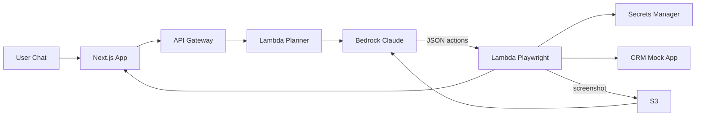

# Architecture — CRM Automation (Outline)



## Components

| Layer | Mô tả |
|-------|-------|
| **Frontend** | Chat UI + CRM mock (cùng repo hoặc tách) |
| **Planner Lambda** | Nhận user message → Bedrock → action plan JSON |
| **Runner Lambda** | Playwright Docker: login, click, fill form theo plan |
| **Vision loop** | Screenshot → Bedrock vision → sửa selector/action nếu fail |
| **Secrets Manager** | Username/password CRM — không hardcode |

## Action plan JSON (ví dụ)

```json
{
  "actions": [
    { "type": "navigate", "url": "/login" },
    { "type": "fill", "selector": "#email", "value": "{{secret:crm_email}}" },
    { "type": "fill", "selector": "#password", "value": "{{secret:crm_password}}" },
    { "type": "click", "selector": "button[type=submit]" },
    { "type": "fill", "selector": "#lead-name", "value": "Nguyễn Văn A" },
    { "type": "click", "selector": "#save-lead" }
  ]
}
```

## Lưu ý kỹ thuật

- Playwright trên Lambda cần custom Docker image (không dùng zip thường)
- Timeout Lambda max 15 phút — đủ cho CRM flow ngắn
- CRM mock host trên cùng domain hoặc public URL để Playwright truy cập

## Chưa làm (chờ duyệt)

- CFN / IaC templates
- Chi tiết IAM, VPC
- WebSocket vs polling cho chat
