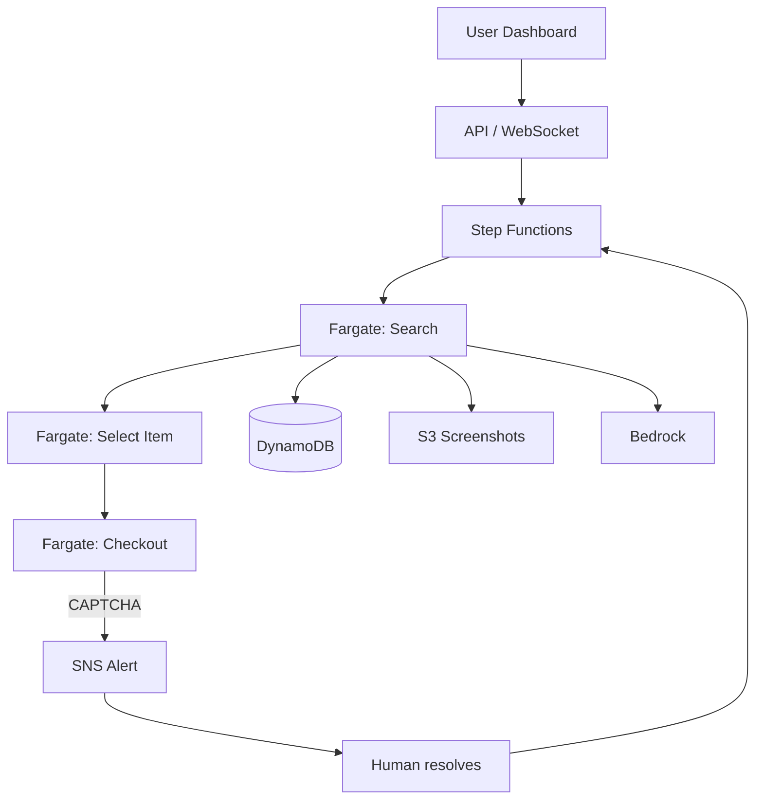

# Architecture — Deal Hunter (Outline)



## Flow chính

1. User tạo campaign (sản phẩm, giá max, địa chỉ giao)
2. Step Functions kick off Fargate task
3. Playwright: search → filter deal → add to cart
4. Mỗi bước ghi log + screenshot → DynamoDB + S3
5. Dashboard poll/WebSocket hiển thị timeline
6. Gặp CAPTCHA → dừng + SNS → user xử lý → resume workflow

## Tại sao Fargate (không Lambda)

| | Lambda | Fargate |
|---|--------|---------|
| Max runtime | 15 phút | Không giới hạn (hours) |
| Browser session | Khó giữ state | Giữ session liên tục |
| Cold start | Cao với Docker | Task warm lâu hơn |

## Human-in-the-loop

```
CAPTCHA detected → Step Functions: Wait for callback token
→ SNS gửi link/dashboard notification
→ User giải CAPTCHA trên remote hoặc nhập token
→ Workflow tiếp tục
```

## Chưa làm (chờ duyệt)

- Mock e-commerce store design
- IaC (ECS task def, Step Functions ASL)
- Chi phí estimate chi tiết
