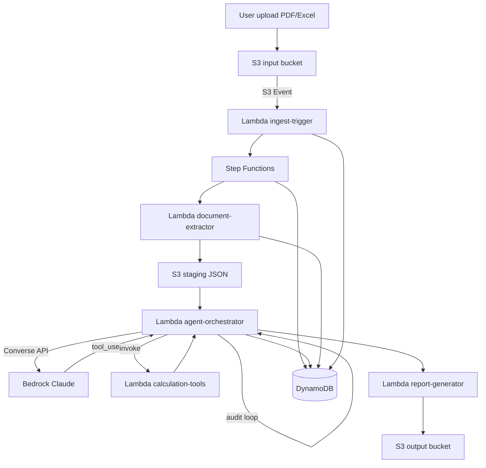
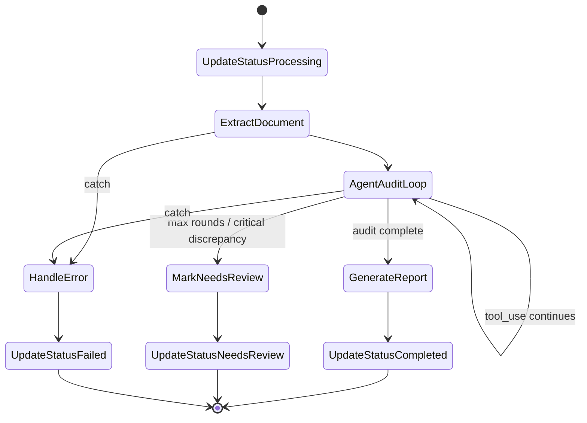

# Architecture — Financial Audit Agent

## System Context



## Component Responsibilities

### 1. S3 Buckets

| Bucket | Purpose | Key pattern |
|--------|---------|-------------|
| Input | Upload báo cáo gốc | `uploads/{jobId}/{filename}` |
| Staging | JSON đã extract | `staging/{jobId}/extracted.json` |
| Output | Audit report | `reports/{jobId}/audit-report.md` |

- Encryption: SSE-S3 (default) hoặc SSE-KMS (production)
- Block public access: enabled
- Versioning: optional trên input bucket

### 2. Lambda Functions

| Function | Trigger | Responsibility |
|----------|---------|----------------|
| `ingest-trigger` | S3 `ObjectCreated` | Tạo jobId, ghi DynamoDB `METADATA`, start Step Functions |
| `document-extractor` | Step Functions task | Parse PDF/Excel → structured JSON → S3 staging |
| `agent-orchestrator` | Step Functions task | Bedrock Converse loop, dispatch tool calls |
| `calculation-tools` | Invoked by orchestrator | Deterministic math: ratios, reconcile, validate |
| `report-generator` | Step Functions task | Compile findings → Markdown report → S3 output |

### 3. Amazon Bedrock — Converse API + Tool Use

**Flow mỗi agent round:**

```
1. Orchestrator gửi messages + toolConfig → bedrock:Converse
2. Model trả stopReason = "tool_use" + toolUse blocks
3. Orchestrator invoke calculation-tools Lambda với tool input
4. Orchestrator gửi toolResult blocks → bedrock:Converse (tiếp)
5. Lặp cho đến stopReason = "end_turn" hoặc maxRounds
```

**Tại sao Converse API (không phải InvokeModel raw)?**
- Native multi-turn conversation
- Built-in tool use protocol
- Dễ map tool definitions → Lambda handlers

### 4. AWS Step Functions

State machine điều phối dependency chain:



**Retry policy (Bedrock throttle):**

```yaml
Retry:
  - ErrorEquals: ["ThrottlingException", "ServiceUnavailableException"]
    IntervalSeconds: 2
    MaxAttempts: 5
    BackoffRate: 2
```

### 5. DynamoDB

Single-table design — xem [DATA-MODEL.md](DATA-MODEL.md).

GSI (optional Phase 5): `GSI1` — query jobs by `status` + `createdAt`.

## IAM Least-Privilege Matrix

| Principal | S3 Input | S3 Staging | S3 Output | DynamoDB | Bedrock | Step Functions | Lambda invoke |
|-----------|----------|------------|-----------|----------|---------|----------------|---------------|
| ingest-trigger | Read | — | — | Write | — | StartExecution | — |
| document-extractor | Read | Write | — | Write | — | — | — |
| agent-orchestrator | Read staging | Read | — | Write | Converse | — | calculation-tools |
| calculation-tools | — | — | — | — | — | — | — |
| report-generator | — | Read | Write | Write | — | — | — |
| Step Functions | — | — | — | Write | — | — | All task Lambdas |

## Agentic Self-Correcting Loop

```
┌─────────────────────────────────────────────────────┐
│  1. READ extracted financial data                   │
│  2. PLAN which validations to run                   │
│  3. ACT — call tools (calculate, reconcile, etc.)   │
│  4. OBSERVE — compare tool output vs source numbers │
│  5. REFLECT — discrepancy? → log + decide next step │
│  6. REPEAT or STOP → generate findings              │
└─────────────────────────────────────────────────────┘
```

**Discrepancy handling:**

| Severity | Action |
|----------|--------|
| Minor (< 1% rounding) | Log warning, continue |
| Material | Flag in report, status `NEEDS_REVIEW` |
| Critical (missing data) | Stop loop, status `FAILED` |

## Failure Modes

| Failure | Detection | Mitigation |
|---------|-----------|------------|
| Bedrock throttle | `ThrottlingException` | Step Functions retry + exponential backoff |
| Extraction fail | Lambda error / empty JSON | Catch → `FAILED`, log raw file ref |
| Tool timeout | Lambda timeout 30s | Reduce input size, split validations |
| Agent infinite loop | maxRounds = 10 | Force stop → `NEEDS_REVIEW` |
| S3 event duplicate | Same jobId exists | Idempotency check in ingest-trigger |

## Security

- **Upload:** Presigned URL (Phase 5) hoặc CLI upload cho dev
- **Encryption:** SSE-S3 at rest, TLS in transit
- **Logging:** Không log raw financial numbers — chỉ log jobId + step
- **IAM:** Mỗi Lambda 1 execution role, không shared admin role
- **Bedrock:** Không gửi data ra ngoài AWS account

## Scalability Notes

- Mỗi upload = 1 Step Functions execution (isolated)
- Lambda concurrency limit mặc định 1000 — đủ cho demo
- DynamoDB on-demand — auto-scale
- Bottleneck thực tế: Bedrock token rate limit → queue nếu scale production

## Future Enhancements (out of scope)

- API Gateway + Cognito cho web upload UI
- SQS buffer giữa S3 event và Step Functions
- Multi-file batch audit
- PDF report output (hiện tại Markdown)
