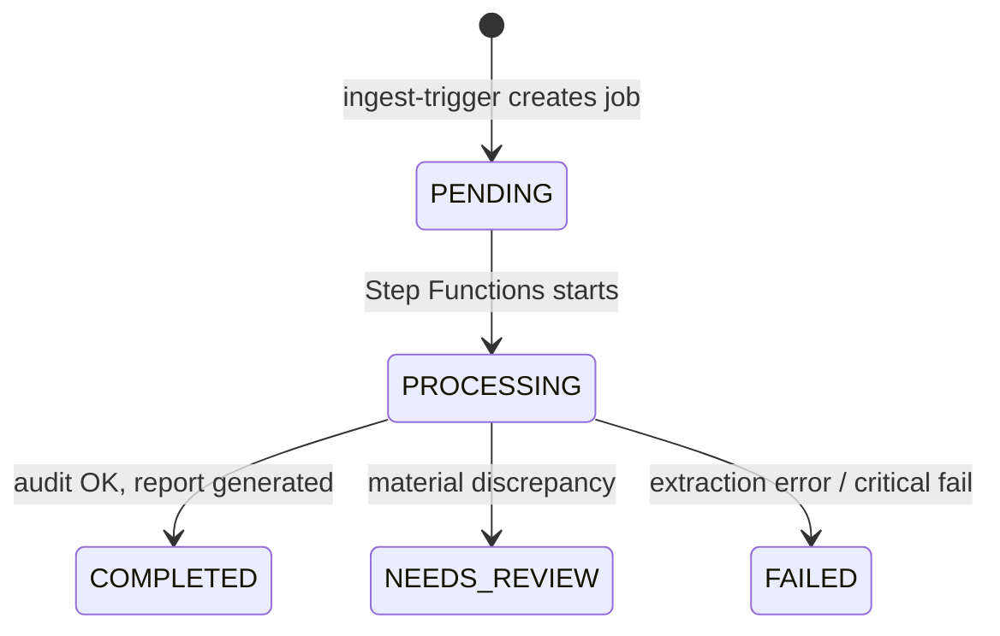

# Data Model — Financial Audit Agent

## DynamoDB — Single Table Design

**Table name:** `{project-name}-{environment}-jobs`

### Primary Keys

| Attribute | Type | Description |
|-----------|------|-------------|
| `PK` | String | Partition key — `JOB#<jobId>` |
| `SK` | String | Sort key — entity type |

### Entity Types

#### METADATA (1 per job)

```
PK: JOB#abc-123-def
SK: METADATA

Attributes:
  jobId:       "abc-123-def"
  fileName:    "Q4-2025-report.xlsx"
  s3InputKey:  "uploads/abc-123-def/Q4-2025-report.xlsx"
  status:      "PENDING" | "PROCESSING" | "COMPLETED" | "NEEDS_REVIEW" | "FAILED"
  createdAt:   "2026-07-03T10:00:00Z"
  updatedAt:   "2026-07-03T10:05:00Z"
  period:      "Q4-2025"
  errorMessage: null | "extraction failed: ..."
  executionArn: "arn:aws:states:..." (Step Functions ARN)
```

#### AUDIT#<step> (N per job)

```
PK: JOB#abc-123-def
SK: AUDIT#001

Attributes:
  step:         1
  toolName:     "calculate_financial_ratio"
  toolInput:    { "numerator": 150000, "denominator": 100000, "ratioType": "current_ratio" }
  toolOutput:   { "result": 1.5, "unit": "ratio" }
  sourceValue:  1.48
  discrepancy:  0.02
  severity:     "minor" | "material" | "critical"
  timestamp:    "2026-07-03T10:02:30Z"
```

#### REPORT (1 per job)

```
PK: JOB#abc-123-def
SK: REPORT

Attributes:
  s3OutputKey:  "reports/abc-123-def/audit-report.md"
  summary:      "3 findings: 1 material discrepancy in Current Ratio"
  findingsCount: 3
  generatedAt:  "2026-07-03T10:05:00Z"
```

### GSI1 — Query by Status (optional, Phase 5)

```
GSI1PK: status (e.g., "PROCESSING")
GSI1SK: createdAt

Use case: Dashboard — list all in-progress jobs
```

### Access Patterns

| Pattern | Key condition | Used by |
|---------|---------------|---------|
| Get job metadata | PK=JOB#id, SK=METADATA | All Lambdas |
| List audit steps | PK=JOB#id, SK begins_with AUDIT# | report-generator |
| Get report | PK=JOB#id, SK=REPORT | API (future) |
| List jobs by status | GSI1PK=status | Dashboard (future) |

### Status State Machine



---

## S3 Key Layout

### Input Bucket

```
uploads/
  {jobId}/
    {original-filename}          # e.g., Q4-2025-report.xlsx
```

### Staging Bucket

```
staging/
  {jobId}/
    extracted.json               # Structured financial data
    extraction-meta.json         # Parser info, warnings (optional)
```

### Output Bucket

```
reports/
  {jobId}/
    audit-report.md              # Human-readable report
    audit-report.json            # Machine-readable findings (optional)
```

---

## Extracted JSON Schema

File: `staging/{jobId}/extracted.json`

```json
{
  "$schema": "financial-audit-agent/extracted/v1",
  "jobId": "abc-123-def",
  "sourceFile": "Q4-2025-report.xlsx",
  "period": "Q4-2025",
  "currency": "USD",
  "lineItems": [
    {
      "id": "rev-total",
      "category": "Income Statement",
      "label": "Total Revenue",
      "value": 1500000,
      "parentId": null
    },
    {
      "id": "rev-product",
      "category": "Income Statement",
      "label": "Product Revenue",
      "value": 1200000,
      "parentId": "rev-total"
    },
    {
      "id": "rev-service",
      "category": "Income Statement",
      "label": "Service Revenue",
      "value": 300000,
      "parentId": "rev-total"
    },
    {
      "id": "assets-current",
      "category": "Balance Sheet",
      "label": "Current Assets",
      "value": 800000,
      "parentId": null
    },
    {
      "id": "liab-current",
      "category": "Balance Sheet",
      "label": "Current Liabilities",
      "value": 533333,
      "parentId": null
    }
  ],
  "metadata": {
    "extractedAt": "2026-07-03T10:01:00Z",
    "parser": "openpyxl",
    "parserVersion": "1.0",
    "warnings": []
  }
}
```

---

## Audit Report Schema (output)

File: `reports/{jobId}/audit-report.md`

```markdown
# Financial Audit Report

**Job ID:** abc-123-def
**Source:** Q4-2025-report.xlsx
**Period:** Q4-2025
**Status:** COMPLETED | NEEDS_REVIEW
**Generated:** 2026-07-03T10:05:00Z

## Summary
- Total validations: 5
- Passed: 3
- Warnings: 1
- Material findings: 1

## Findings

### F001 — Current Ratio Discrepancy (MATERIAL)
- **Reported:** 1.48
- **Calculated:** 1.50
- **Delta:** 0.02 (1.35%)
- **Tool:** calculate_financial_ratio

## Audit Trail
| Step | Tool | Result | Severity |
|------|------|--------|----------|
| 1 | reconcile_line_items | PASS | — |
| 2 | calculate_financial_ratio | DISCREPANCY | material |
```

---

## Tool Input/Output Schemas

### calculate_financial_ratio

```json
// Input
{
  "ratioType": "current_ratio" | "roe" | "debt_to_equity",
  "numerator": 800000,
  "denominator": 533333,
  "reportedValue": 1.48
}

// Output
{
  "calculatedValue": 1.5,
  "reportedValue": 1.48,
  "discrepancy": 0.02,
  "discrepancyPercent": 1.35,
  "severity": "minor" | "material" | "critical",
  "passed": false
}
```

### reconcile_line_items

```json
// Input
{
  "parentId": "rev-total",
  "parentValue": 1500000,
  "childIds": ["rev-product", "rev-service"]
}

// Output
{
  "childrenSum": 1500000,
  "parentValue": 1500000,
  "discrepancy": 0,
  "passed": true
}
```

### cross_validate_periods

```json
// Input
{
  "currentPeriodValue": 1500000,
  "priorPeriodValue": 1400000,
  "metric": "Total Revenue",
  "tolerancePercent": 50
}

// Output
{
  "changePercent": 7.14,
  "passed": true,
  "anomaly": false,
  "note": "Revenue grew 7.14% YoY — within normal range"
}
```

### generate_audit_finding

```json
// Input
{
  "findingType": "discrepancy" | "missing_data" | "anomaly",
  "severity": "minor" | "material" | "critical",
  "description": "Current ratio mismatch",
  "evidence": { "calculated": 1.5, "reported": 1.48 }
}

// Output
{
  "findingId": "F001",
  "findingType": "discrepancy",
  "severity": "material",
  "description": "Current ratio mismatch",
  "evidence": { "calculated": 1.5, "reported": 1.48 },
  "recommendation": "Verify Current Assets and Current Liabilities line items"
}
```

---

## Idempotency

- `jobId` = UUID v4, generated by `ingest-trigger`
- Nếu S3 event fire duplicate cho cùng key → check DynamoDB `METADATA` exists → skip
- Step Functions execution name = `jobId` (unique per execution)

## TTL (optional)

- Attribute `ttl` trên `METADATA` — auto-delete sau 90 ngày (dev cleanup)
