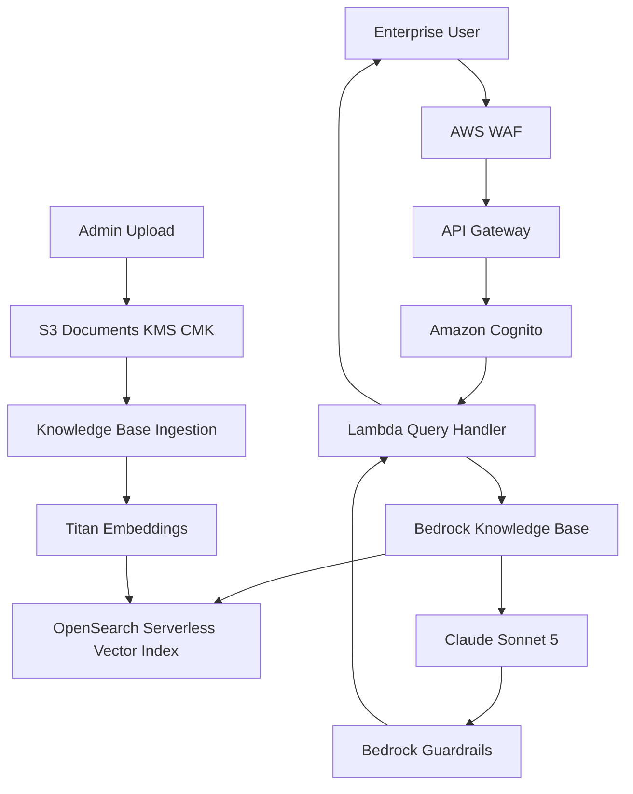

# Architecture — Enterprise RAG (Outline)

> **Status:** Skeleton — chi tiết hóa sau Project 1.

## System Context

## Components (planned)

### 1. Document Storage

- S3 bucket với KMS Customer Managed Key (CMK)
- Key layout: `tenants/{tenantId}/documents/{docId}/{filename}`
- Bucket policy: deny unencrypted uploads
- Versioning enabled

### 2. Bedrock Knowledge Base

- Data source: S3 bucket
- Chunking strategy: fixed-size hoặc semantic chunking
- Embedding model: Amazon Titan Text Embeddings v2
- Vector store: OpenSearch Serverless collection

### 3. Query Pipeline

1. User gửi câu hỏi qua API (authenticated bởi Cognito)
2. WAF filter malicious requests
3. Lambda gọi `bedrock-agent-runtime:RetrieveAndGenerate`
4. Top-K chunks retrieved từ OpenSearch
5. Claude sinh câu trả lời grounded trên context
6. Guardrails scan output → chặn PII leak

### 4. Security Layers

| Layer | Protection |
|-------|-----------|
| WAF | SQL injection, rate limiting, geo-blocking |
| Cognito | User pools, MFA, JWT tokens |
| API Gateway | Throttling, API keys |
| KMS | Encryption at rest |
| IAM | Least-privilege per tenant |
| Guardrails | PII filter, topic deny list |
| VPC (optional) | Private OpenSearch endpoint |

### 5. Multi-Tenant Pattern

- `tenantId` trong Cognito custom attribute
- S3 prefix isolation: `tenants/{tenantId}/`
- OpenSearch metadata filter: `{ "term": { "tenantId": "..." } }`
- IAM condition keys restrict cross-tenant access

## Key Design Decisions (TBD)

- [ ] OpenSearch Serverless vs Aurora pgvector
- [ ] API Gateway REST vs HTTP API
- [ ] Cognito vs IAM Identity Center for enterprise SSO
- [ ] Chunk size và overlap tuning
- [ ] Citation format trong response

## SAA-C03 Hooks

- KMS key policies và rotation
- WAF rule groups và logging
- Cognito user pool vs identity pool
- VPC endpoints cho private service access
- Cost: OpenSearch OCUs vs provisioned capacity

## Next Steps

Xem [PLAN.md](PLAN.md) — bắt đầu sau khi Project 1 Phase 5 hoàn thành.
