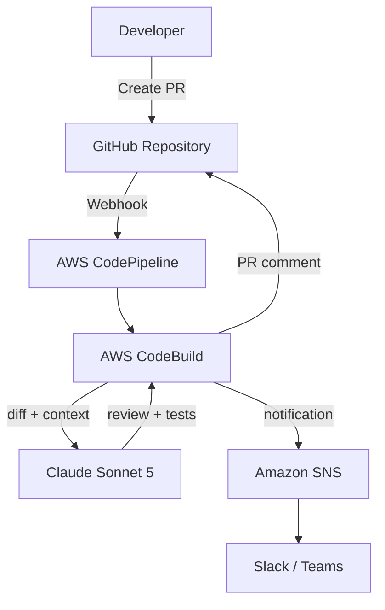

# Architecture — DevOps Testing Agent (Outline)

> **Status:** Skeleton — chi tiết hóa sau Project 1.

## System Context



## Components (planned)

### 1. Source Repository

- Sample microservice: 1 API service (C#/.NET hoặc Node.js)
- Branch protection: require PR for merge
- Webhook: PR opened/updated → trigger pipeline

### 2. CI/CD Pipeline

**Option A: AWS CodePipeline**
```
Source (GitHub via CodeStar) → Build (CodeBuild) → Notify (SNS)
```

**Option B: GitHub Actions** (simpler for portfolio)
```
on: pull_request → build job → Bedrock review → comment
```

### 3. CodeBuild Review Step

1. Checkout code + fetch PR diff (`git diff base...head`)
2. Build context: changed files + related test files
3. Send to Bedrock với specialized prompt:
   - Security scan (OWASP top 10 patterns)
   - Code smell detection
   - Cypress test generation cho new endpoints
4. Parse structured response
5. Post comment on PR (GitHub API)
6. Publish SNS notification

### 4. Bedrock Prompts (planned)

| Prompt | Output |
|--------|--------|
| `security-review.md` | Vulnerabilities list với severity |
| `code-quality.md` | Code smells + suggestions |
| `test-generation.md` | Cypress test file content |

### 5. Notification

- SNS topic → Slack webhook subscription
- Message format: PR link, issue count, severity summary

## Security Considerations

- CodeBuild IAM role: least-privilege, no admin
- GitHub token trong Secrets Manager (không hardcode)
- Bedrock: chỉ gửi diff, không gửi secrets/env files
- `.gitignore` check: warn nếu PR thêm credentials

## Key Design Decisions (TBD)

- [ ] CodePipeline vs GitHub Actions
- [ ] Block merge on CRITICAL findings vs advisory only
- [ ] Test file commit: auto-commit vào PR branch vs comment only
- [ ] Language support: C# first hay Node.js first

## SAA-C03 Hooks

- CodePipeline stages và artifacts
- CodeBuild environment và caching
- IAM roles for CI/CD service
- SNS fan-out pattern
- Secrets Manager vs SSM Parameter Store

## Next Steps

Xem [PLAN.md](PLAN.md) — bắt đầu sau Project 1 hoặc song song nếu hướng DevOps.
