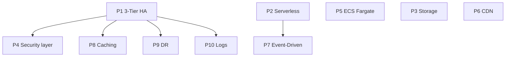

# Overview — 10 Dự Án SAA-C03

> Docs sơ bộ. Chi tiết CFN / RUNBOOK triển khai sau.

## Map theo 4 domain đề thi

| Domain | Dự án |
|--------|-------|
| **Resilient architectures** | P1 (3-tier HA), P9 (DR) |
| **High-performance** | P6 (CDN), P8 (ElastiCache), P10 (log streaming) |
| **Secure applications** | P4 (IAM/KMS/GuardDuty), P6 (WAF), P2 (Cognito) |
| **Cost-optimized** | P3 (S3 lifecycle/Glacier), P2 (serverless), P5 (Fargate vs EC2) |

## Bảng tổng hợp

| # | Tên | Services chính | Độ khó | Chi phí dev |
|---|-----|----------------|--------|-------------|
| 1 | 3-Tier HA Web | VPC, ALB, ASG, RDS Multi-AZ, Route 53 | Trung bình | $$ |
| 2 | Serverless Pipeline | S3, Lambda, DynamoDB, API GW, Cognito | Dễ–TB | $ |
| 3 | Hybrid Storage | Storage Gateway, S3, Lifecycle, Glacier | TB | $ |
| 4 | Secure Monitoring | IAM, KMS, CloudTrail, CloudWatch, GuardDuty | Dễ (layer trên P1) | $ |
| 5 | ECS Fargate | ECR, ECS, Fargate, ALB | Trung bình | $$ |
| 6 | CloudFront CDN | S3, CloudFront, ACM, WAF, Route 53 | Dễ–TB | $ |
| 7 | Event-Driven | SNS, SQS, Lambda, EventBridge | Trung bình | $ |
| 8 | DB Caching | RDS, ElastiCache, EC2 | Trung bình | $$ |
| 9 | Cross-Region DR | Route 53 failover, RDS CRR, S3 CRR | Cao | $$$ |
| 10 | Log Analytics | CloudWatch Logs, Firehose, OpenSearch | Cao | $$$ |

## Lộ trình 30 ngày

### Tuần 1 — Core Infrastructure (P1, P2, P3)

| Ngày | Focus |
|------|-------|
| 1–2 | P1: VPC 2 AZ, public/private subnets |
| 3–4 | P1: ALB + ASG + RDS Multi-AZ |
| 5 | P2: S3 → Lambda → DynamoDB |
| 6 | P2: API Gateway + Cognito |
| 7 | P3: S3 lifecycle + Glacier policies |

**SAA focus:** VPC, subnet, NAT, ALB vs NLB, ASG scaling policy, RDS Multi-AZ

### Tuần 2 — Storage, DB, Security (P4, P5, P8)

| Ngày | Focus |
|------|-------|
| 8–9 | P4: IAM least privilege + KMS encryption |
| 10 | P4: CloudTrail + GuardDuty + alarms |
| 11–12 | P5: Docker → ECR → ECS Fargate |
| 13–14 | P8: ElastiCache Redis + cache-aside pattern |

**SAA focus:** IAM policies, KMS CMK, ECS vs EKS, ElastiCache vs DAX vs Read Replica

### Tuần 3 — Advanced (P6, P7, P9, P10)

| Ngày | Focus |
|------|-------|
| 15–16 | P6: CloudFront + OAC + WAF |
| 17–18 | P7: SNS fan-out → SQS → Lambda |
| 19–20 | P9: S3 CRR + RDS cross-region replica + Route 53 failover |
| 21–22 | P10: Logs → Firehose → OpenSearch |

**SAA focus:** DR strategies (RPO/RTO), decoupling, edge caching, streaming

### Tuần 4 — Practice Exams

- 4–5 bộ đề full (65 câu / 130 phút)
- Review sai: map về dự án tương ứng
- Không deploy dự án mới — ôn và làm đề

## Thứ tự & phụ thuộc

- **P4, P8** nên làm sau P1 (có hạ tầng sẵn để gắn security/caching)
- **P9** tốn nhất — làm cuối tuần 3, teardown sau khi hiểu concept
- **P10** tốn (OpenSearch) — có thể thay OpenSearch bằng S3 archive cho MVP

## Rủi ro chi phí

| Dự án | Cost driver | Mitigation |
|-------|-------------|------------|
| P1, P8 | RDS + EC2 chạy 24/7 | Stop instances khi không lab |
| P9 | 2 regions + RDS replica | Teardown ngay sau lab |
| P10 | OpenSearch domain | Dùng t3.small.search, xóa sau lab |
| P5 | Fargate tasks | Scale to 0 / stop service |

## Gợi ý khi trình bày / phỏng vấn

Mỗi dự án nên trả lời được 3 câu:
1. **Tại sao chọn service này** (so với alternative)?
2. **Failure mode** — service down thì sao?
3. **Cost** — optimize thế nào?

## Chưa làm (chờ triển khai)

- CloudFormation templates
- RUNBOOK deploy/teardown
- Chi phí estimate chi tiết từng project
