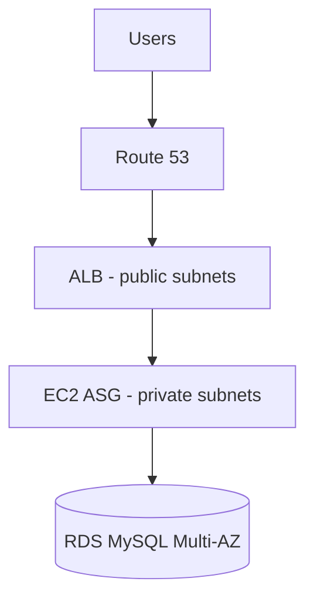

# Architecture — 3-Tier HA Web (Outline)

## VPC layout (2 AZ)

| Subnet | AZ-a | AZ-b |
|--------|------|------|
| Public | ALB, NAT GW | ALB, NAT GW |
| Private | EC2 ASG | EC2 ASG |
| Database | RDS primary | RDS standby |

## Key configs

- ASG: scale on CPU > 70%, min 2 / max 4
- ALB health check → unhealthy instance replaced
- RDS Multi-AZ: automatic failover
- Security groups: ALB → EC2 → RDS (layered)

## Chưa làm

- CloudFormation templates
- AMI / user-data script
