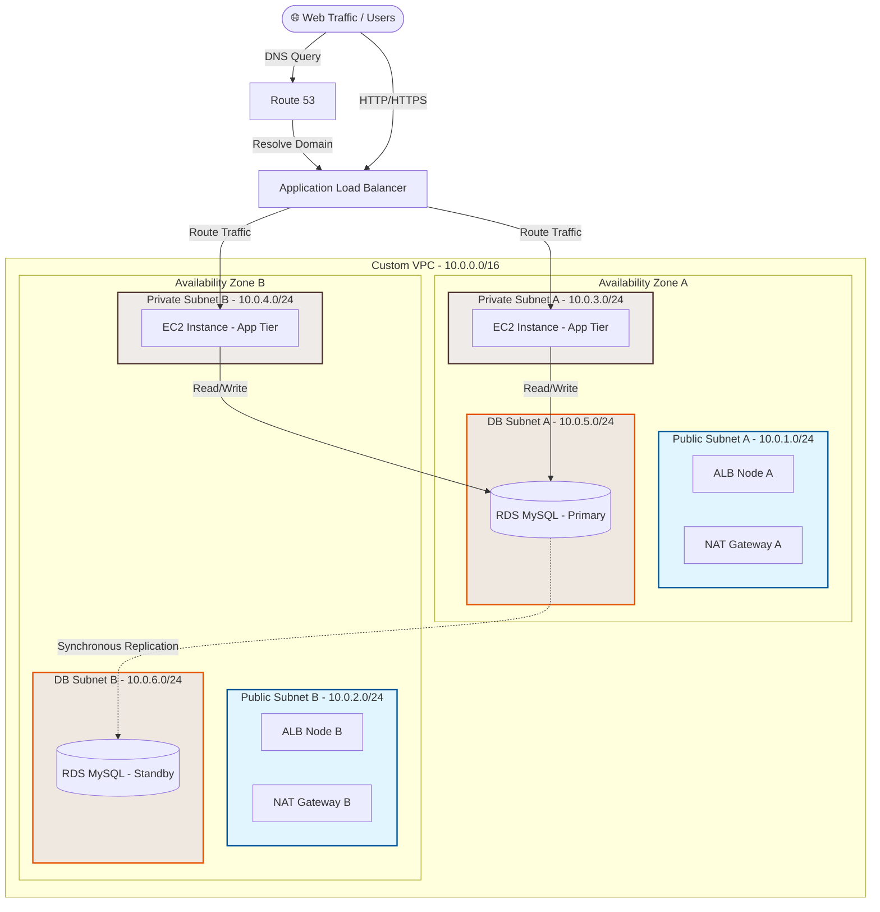

# Architectural Design Document: 3-Tier Highly Available Web Architecture

> Chưa rõ dự án làm gì? Đọc trước: **[OVERVIEW.md](OVERVIEW.md)**

## 📊 Overview & Structural Layout

Kiến trúc này tuân thủ chặt chẽ **AWS Well-Architected Framework**, đảm bảo tính cô lập tối đa giữa các tầng mạng và khả năng tự phục hồi (_self-healing_) khi xảy ra sự cố ở cấp độ hạ tầng hoặc toàn bộ một Availability Zone (AZ).

