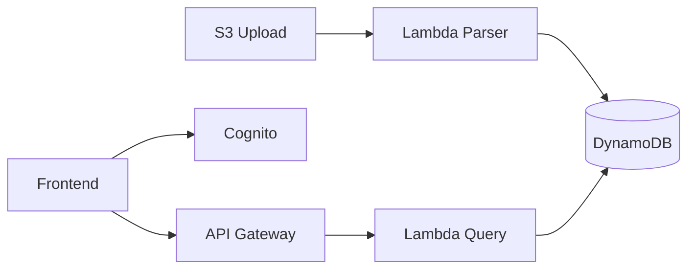

# Architecture — Serverless Pipeline (Outline)

## Flow

1. User upload `data.csv` → S3 event → Lambda parse rows → DynamoDB batch write
2. Frontend login Cognito → JWT → API Gateway authorizer
3. GET `/items` → Lambda query DynamoDB → JSON response

## Key configs

- S3 event: `s3:ObjectCreated:*` prefix `uploads/`
- DynamoDB on-demand billing (dev)
- Cognito User Pool + App Client

## Chưa làm

- CFN, sample CSV, frontend tối giản
