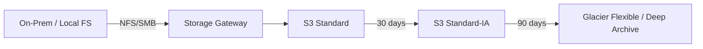

# Architecture — Hybrid Storage (Outline)

## Lifecycle policy (ví dụ)

| Age | Transition |
|-----|------------|
| 0–30 days | S3 Standard |
| 30–90 days | S3 Standard-IA |
| 90+ days | Glacier Flexible Retrieval |

## Lưu ý

- Storage Gateway cần VM/agent — có thể simulate bằng AWS console upload nếu không có on-prem
- Glacier retrieval có latency + cost — hiểu retrieval tiers cho thi

## Chưa làm

- CFN lifecycle rules
- Storage Gateway setup guide chi tiết
