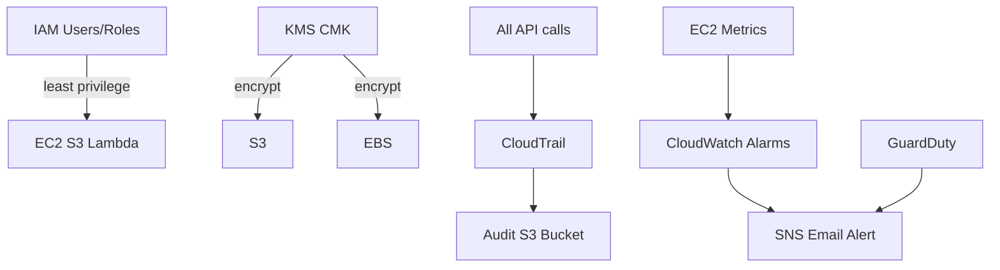

# Architecture — Secure Monitoring (Outline)

## Layers

| Layer | Control |
|-------|---------|
| Identity | IAM policies, roles per service |
| Encryption | KMS CMK on S3 + EBS |
| Audit | CloudTrail multi-region |
| Detect | GuardDuty findings |
| Alert | CloudWatch → SNS |

## Prerequisite

Hạ tầng từ [Project 1](../project-01-3tier-ha-web/) hoặc tương đương.
