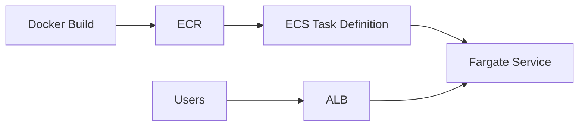

# Architecture — ECS Fargate (Outline)

## Components

| Component | Mô tả |
|-----------|-------|
| ECR | Private image registry |
| Task Definition | CPU, memory, port, image URI |
| ECS Service | Desired count, rolling deploy |
| ALB | Target group + health check `/health` |

## Fargate vs EC2 launch type

| | Fargate | EC2 |
|---|---------|-----|
| Manage servers | No | Yes |
| Cost model | Per task vCPU/memory | EC2 instance hours |
| Use case | Simple workloads | GPU, custom AMI |
