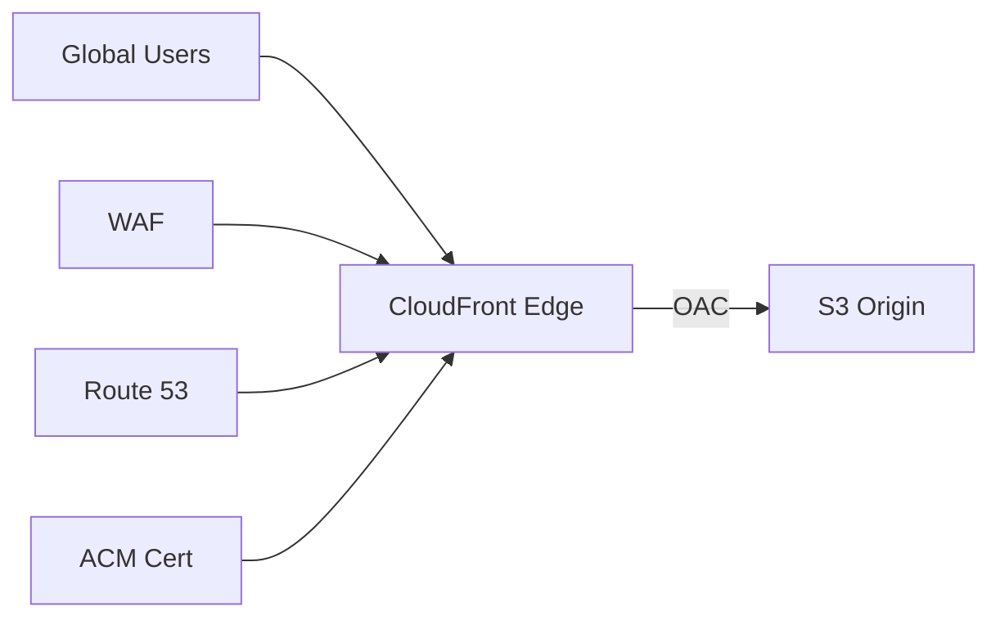

# Architecture — CloudFront CDN (Outline)

## Key configs

- **OAC:** S3 bucket policy chỉ allow CloudFront distribution
- **Cache behaviors:** TTL cho static assets (CSS/JS/images)
- **WAF:** AWS Managed Rules (Common, SQLi)
- **ACM:** Cert ở `us-east-1` nếu CloudFront global

## Exam hooks

- CloudFront vs API Gateway caching
- OAC vs OAI (legacy)
- Price class / edge locations
