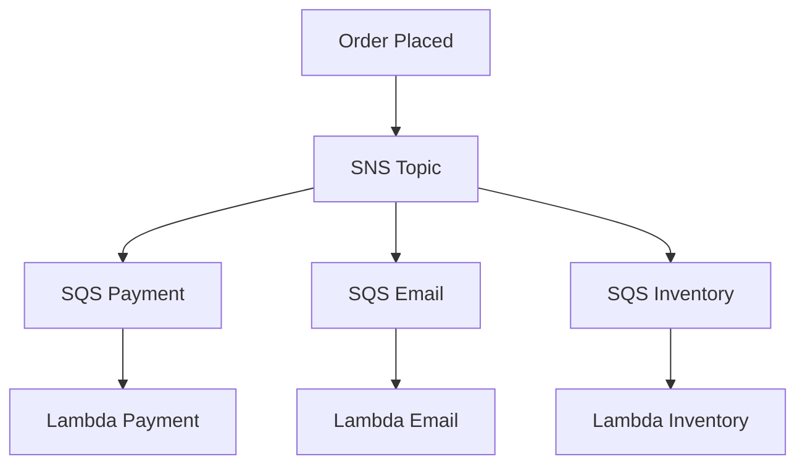

# Architecture — Event-Driven (Outline)

## Pattern: SNS → SQS fan-out

- Mỗi subscriber = 1 SQS queue (durability + retry)
- Lambda poll SQS (batch size, DLQ on fail)
- 1 service fail không block service khác

## vs EventBridge

| SNS+SQS | EventBridge |
|---------|-------------|
| Simple fan-out | Complex routing rules |
| Push to SQS | Event bus pattern |

## Exam hooks

- SQS visibility timeout
- DLQ configuration
- FIFO vs Standard queue
