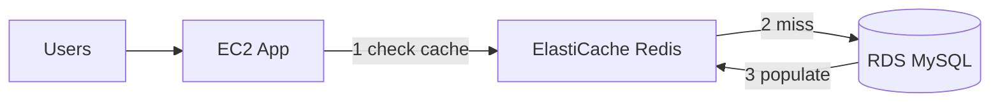

# Architecture — Database Caching (Outline)



## Cache-aside flow

```
GET /product/{id}:
  1. GET redis:product:{id}
  2. if hit → return
  3. if miss → SELECT from RDS
  4. SET redis:product:{id} TTL=300
  5. return
```

## So sánh (đề thi)

| Solution | Use case |
|----------|----------|
| ElastiCache | General purpose cache, session store |
| DAX | DynamoDB only, microsecond latency |
| Read Replica | Read scaling, not cache |

## Prerequisite

RDS từ P1 hoặc standalone RDS instance.
