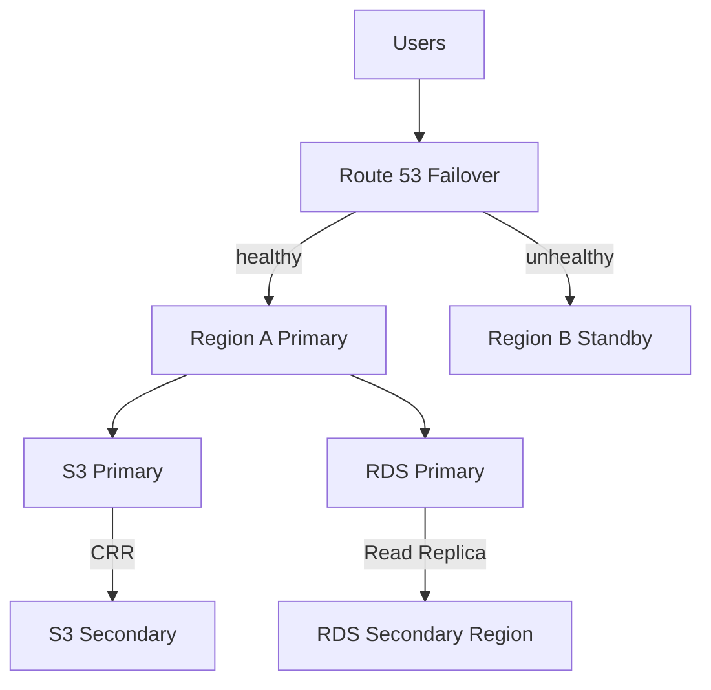

# Architecture — Cross-Region DR (Outline)

## DR strategies (đề thi)

| Strategy | RTO | RPO | Cost |
|----------|-----|-----|------|
| Backup & Restore | Hours | Hours | $ |
| Pilot Light | 10s min | Minutes | $$ |
| Warm Standby | Minutes | Seconds | $$$ |
| Multi-Site | Near zero | Near zero | $$$$ |

Project này ≈ **Pilot Light / Warm Standby** hybrid.

## Failover steps

1. Health check fails on Region A
2. Route 53 routes to Region B endpoint
3. Promote RDS read replica → primary (manual hoặc scripted)
4. App ở Region B serve traffic

## Cost warning

2 regions + RDS replica — teardown ngay sau lab.
