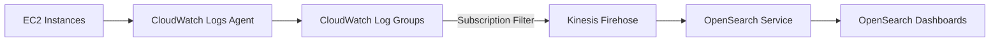

# Architecture — Log Analytics (Outline)

## Pipeline

1. CloudWatch Logs Agent ship `/var/log/app.log` → Log Group
2. Subscription filter match ERROR patterns
3. Firehose buffer + deliver to OpenSearch index
4. Dashboard query: `level:ERROR AND @timestamp:[now-1h TO now]`

## Cost-saving MVP

- Thay OpenSearch bằng **S3 destination** qua Firehose (rẻ hơn)
- Chỉ spin OpenSearch khi cần demo dashboard

## Exam hooks

- CloudWatch Logs vs CloudTrail
- Firehose vs Kinesis Data Streams
- OpenSearch vs Athena on S3 logs
